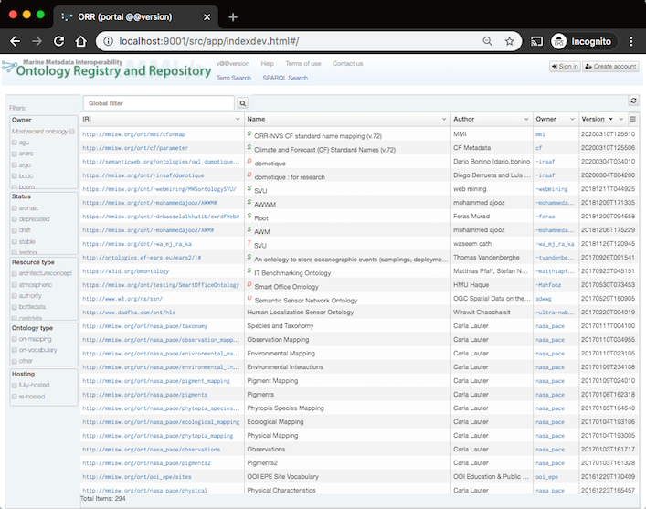

# Development

Based on [NodeJs](https://nodejs.org/),
[Gulp](http://gulpjs.com/),
[AngularJs](https://angularjs.org/),
and several other open-source libraries.

## Local development and testing

To set everything up:

    $ npm install

In all of the following, adjust `src/app/js/local.config.js` as appropriate,
for example, including indication of the target ont service:

```js
appConfig.orront.rest  = "https://mmisw.org/ont";
``` 

Launch server and browser for local development:

    $ gulp dev



## Installing

### Installation for the `ont` service

This is the typical case for actual deployment purposes.

Use `gulp install` as follows depending on destination:
    
- Under an already installed `ont` service, for example:
    
      $ gulp install --base=/ont/ --dest=/opt/tomcat/webapps/ont/

    or under the `ont` source tree (presumably for subsequent packaging of
    the whole integrated ont service including the frontend):
         
      $ gulp install --base=/ont/ --dest=/path/to/orr-ont/src/main/webapp/
            
    In either case, adjust the `--base` parameter depending on the actual
    deployed application context of the `ont` service.
    NOTE: `/ont/` has been the value in all ORR instances installed out there
    that we are aware of. 

### Separate installation of the frontend component

Create installable directory and compressed archive under `dist/`,
adjust `src/app/js/local.config.js` and then:

        $ gulp dist --localConfig

To locally verify a distribution:

        $ gulp try_dist --localConfig --base=/orrportal/

which should open [http://localhost:9001/dist/orrportal/](http://localhost:9001/dist/orrportal/).
